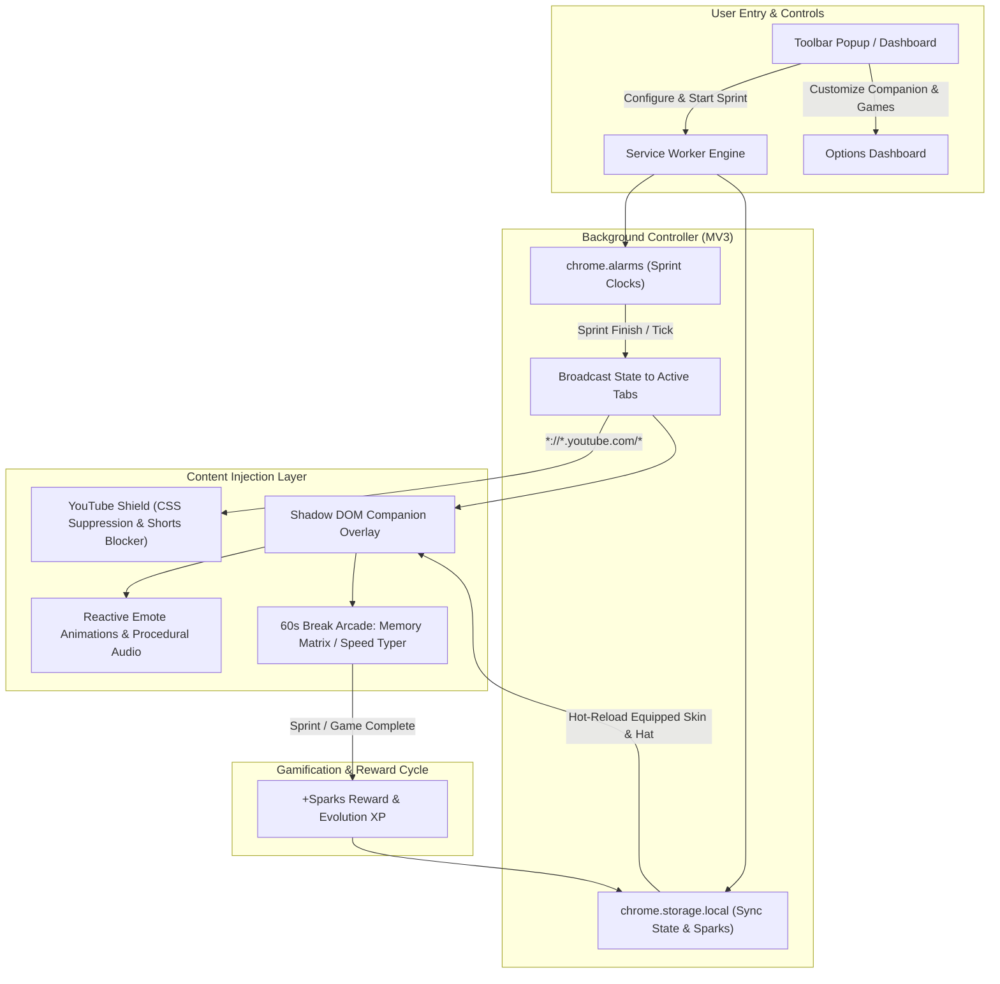

<div align="center">

# ⚡ JIGRA
### Gamified Focus Companion, YouTube Study Shield & Micro-Break Brain Reset Engine

[](https://developer.chrome.com/docs/extensions/mv3/intro/)
[](https://developer.mozilla.org/en-US/docs/Web/JavaScript)
[](https://developer.mozilla.org/en-US/docs/Web/API/Web_Audio_API)
[](https://developer.mozilla.org/en-US/docs/Web/API/Web_components/Using_shadow_DOM)
[](https://github.com/harinarayana1457-cmyk/jigra)
[](https://opensource.org/licenses/MIT)

<p align="center">
  <b>Jigra</b> is an all-in-one browser focus extension engineered with <b>Chrome Extension Manifest V3</b>, procedural Web Audio synthesis, and isolated <b>Shadow DOM</b> architecture. Designed specifically for students, researchers, and developers, Jigra halts algorithmic doom-scrolling (suppressing YouTube Shorts and recommendations), provides an edge-snapping interactive desktop study companion, and rewards completed Pomodoro sprints with 60-second micro-break games, currency (<b>Sparks</b>), and companion evolutions.
</p>

[✨ Key Features](#key-features) • [🏛️ Architecture](#system-architecture) • [🚀 Installation](#installation-guide) • [🎮 Micro-Break Arcade](#micro-break-brain-resets) • [🛍️ Cosmetics & Evolution](#economy-evolution--customization-bazaar) • [📁 Project Structure](#project-structure) • [🧪 Testing Checklist](#testing-checklist) • [🔗 Connect](#connect--contribute)

</div>

---

## 🌟 Key Features

### 1. 🛡️ Context-Aware YouTube Study Shield
* **Smart UI Stripper**: Automatically strips YouTube recommendation feeds (`#secondary`), comments (`#comments`), infinite home scroll walls, and end-screen suggested tiles while a focus sprint is active.
* **Shorts Interceptor**: Intercepts `/shorts/*` single-page transitions instantly without page reloads, displaying an immediate focus shield modal.
* **5-Second Deterrent Lock**: In *Ultra Focus Mode*, leaving a sprint early requires deliberately holding down an override trigger for 5 continuous seconds.
* **Distraction-Free Video Layout**: Centers educational lectures, documentaries, and tutorials with zero algorithmic visual clutter.

### 2. 🪐 Interactive Floating Screen Companion
* **Closed Shadow DOM Encapsulation**: Injected cleanly into every web page without inheriting third-party CSS or interfering with site styles.
* **Physics & Edge-Snapping**: Fully draggable with mouse or trackpad, smoothly gliding and docking to screen borders.
* **Reactive Animated Emote States**:
  * **Focus State**: Gentle breathing motion, reading study notes, focused sparkling eyes, with an integrated real-time countdown pill.
  * **Distraction State**: AudioContext knock sound against the screen, shaking avatar, and warning speech bubbles if visiting blacklisted distraction domains.
  * **Milestone Fanfare**: Victory animation, procedural 8-bit chiptune fanfare, and full-screen confetti bursts (`canvas-confetti`) when a Pomodoro block completes.
* **Mini HUD**: Click the companion at any time to inspect current streaks, level progression, sprint clocks, and open the Bazaar.

### 3. 🎮 Micro-Break Brain Resets (60-Second Mini-Games)
* **6-Pair Memory Matrix**: 12 cards with 3D flip physics, matching pairs of learning icons under a strict 60-second countdown.
* **Speed Quote Typer**: Cyberpunk terminal typing sprint testing WPM and accuracy on curated productivity and stoic literature quotes.
* **Strict 60-Second Ceiling**: When the timer expires, the game pauses immediately, awards **+5 bonus Sparks**, and transitions the student into the next focus block.

### 4. 🛍️ Economy, Evolution & Customization Bazaar
* **Sparks Wallet**: Earn +10 Sparks per standard sprint (+20 for deep, +25 for ultra) and +5 per mini-game session.
* **Cosmetics Bazaar**: Unlock and equip:
  * **Hats & Eyewear**: Study Specs, Arcane Wizard Hat, Gold Monarch Crown, Cyber Headphones.
  * **Companion Skins**: Ignis Ember 🔥, Cryo Frost ❄️, Jade Drake 🐲, Astral Void 🌌.
  * **Auras**: Cosmic Stardust ✨, Cyber Matrix 🟩, Zen Bloom 🌸.
* **4-Tier Evolution Ladder**:
  1. *Flame Sprout* (Lv. 1) &rarr; 2. *Adept Scholar* (Lv. 5) &rarr; 3. *Guardian Phoenix* (Lv. 10) &rarr; 4. *Celestial Sage* (Lv. 20).

---

## 🏛️ System Architecture



---

## 🚀 Installation Guide

Works on any modern Chromium browser (**Google Chrome**, **Brave**, **Microsoft Edge**, **Arc**, **Opera**).

### 1. Clone or Download the Repository
```bash
git clone https://github.com/harinarayana1457-cmyk/jigra.git
cd jigra
```

### 2. Load into Your Browser
1. Open your browser and navigate to the extensions management tab:
   * **Chrome**: `chrome://extensions/`
   * **Brave**: `brave://extensions/`
   * **Edge**: `edge://extensions/`
2. Toggle on **"Developer mode"** (typically in the top-right corner).
3. Click the **"Load unpacked"** button.
4. Select the cloned **`jigra`** root directory (containing `manifest.json`).
5. **Jigra** is now active! Pin it to your extension bar for 1-click access.

---

## 🧪 Testing Checklist

Follow this checklist to verify all subsystems:

1. **Popup & Timer Start**:
   * Click the Jigra icon in your toolbar.
   * Choose between **Standard (25m)**, **Deep Focus (45m)**, or **Ultra (50m)**.
   * Click **Start Focus** &rarr; verify the circular countdown begins and the companion shifts into its focused reading animation.
2. **YouTube Shield Verification**:
   * Navigate to `https://www.youtube.com/`.
   * Verify home recommendations are replaced with the clean Jigra focus placeholder.
   * Open any tutorial: verify sidebar recommendations (`#secondary`) and comments (`#comments`) are stripped.
   * Open `https://www.youtube.com/shorts/`: verify the interceptor halts the video and presents the focus shield modal.
3. **Screen Companion Verification**:
   * Open any website (e.g. Wikipedia, GitHub).
   * Notice the floating flame companion docked in the bottom-right corner.
   * Drag the companion anywhere on the viewport; observe smooth edge snapping.
   * Click the avatar to open the mini HUD and check your current level, streak, and Sparks.
4. **Micro-Break Mini-Games**:
   * Complete a sprint or trigger a break.
   * Play the **6-Pair Memory Matrix** or **Speed Quote Typer**.
   * Verify the 60-second hard countdown, completion chime, and +5 bonus Sparks award.
5. **Cosmetics Bazaar**:
   * Open the **Cosmetics Bazaar** tab.
   * Spend your starting bonus on **Study Specs** or save up for the **Arcane Wizard Hat** or **Cryo Frost** skin.
   * Click **Equip** and observe the companion update across all open tabs immediately.

---

## 📁 Project Structure

```text
jigra/
├── background/
│   └── service_worker.js         # Manifest V3 worker, chrome.alarms, notifications & state dispatch
├── content_scripts/
│   ├── youtube_shield.css        # Zero-lag YouTube DOM recommendation suppression
│   ├── youtube_shield.js         # YouTube SPA navigation hook & Shorts interceptor
│   ├── companion_overlay.css     # Shadow DOM floating companion styles, themes & keyframes
│   ├── companion_overlay.js      # Draggable companion controller with reactive state machines
│   └── confetti.js               # Lightweight zero-dependency canvas confetti engine
├── dashboard/
│   ├── dashboard.html            # Hub, Cosmetics Bazaar, Evolution Tree & Arcade
│   ├── dashboard.css             # Glassmorphic cyber theme & layout styling
│   ├── dashboard.js              # Dashboard state manager & event listeners
│   └── games/
│       ├── memory_match.js       # 6-Pair Memory Matrix 3D card game
│       └── speed_typer.js        # 60-second Speed Quote Typer game
├── popup/
│   ├── popup.html                # Clean toolbar popup window
│   ├── popup.css                 # Circular neon timer styling
│   └── popup.js                  # Popup sprint controller & real-time sync
├── shared/
│   ├── storage.js                # chrome.storage.local schema, migrations & helpers
│   ├── audio.js                  # Web Audio API procedural sound synthesizer (fanfare, knocks)
│   └── companion_renderer.js     # SVG vector companion generator with cosmetics & emotes
├── icons/                        # Extension icons (16, 32, 48, 128 px)
│   ├── icon16.png
│   ├── icon32.png
│   ├── icon48.png
│   └── icon128.png
├── manifest.json                 # Chrome Extension Manifest V3 configuration
├── .gitignore                    # Production ignore rules
└── README.md                     # Project documentation
```

---

## 🔗 Connect & Contribute

* **Author**: [Hari Narayana (@harinarayana1457-cmyk)](https://github.com/harinarayana1457-cmyk)
* **LinkedIn**: [](https://www.linkedin.com/in/hari-narayana-035ba1389/)
* Feature requests, feedback, and pull requests are warmly welcomed!

---

## 📄 License

* Distributed under the **[MIT License](https://opensource.org/licenses/MIT)**.
